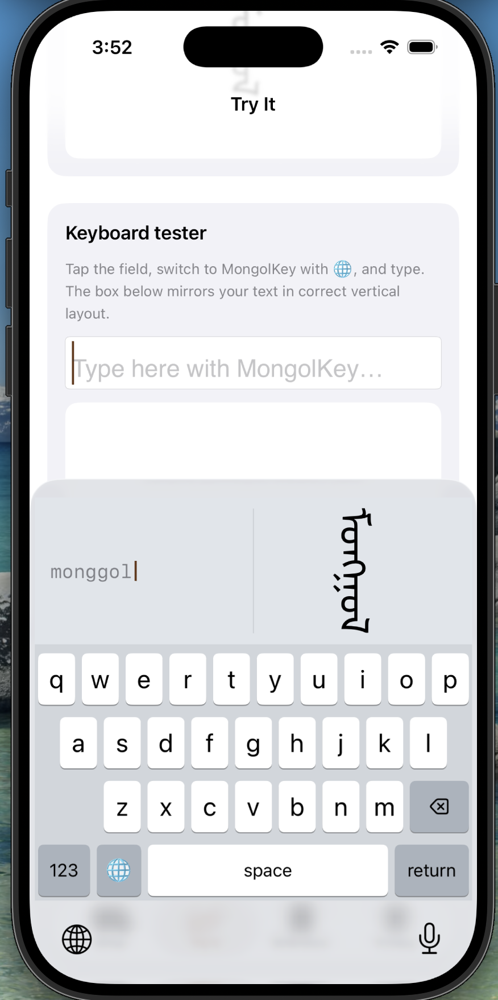

# MongolKey — Mongolian Script Keyboard for iOS

A QWERTY-based transliteration input method for **traditional Mongolian script**
(_Mongol bichig_), built as a native iOS Custom Keyboard Extension. Type the
sounds in Latin letters — e.g. `monggol` — and the engine emits correct Mongolian
Unicode, shown **vertically** as you type on QWERTY keybaord.

This repository implements **v1** as described in `PROJECT_DESCRIPTION.md`.

<p>
  
</p>

---

## What works (verified)

Verified by unit tests and by running the app + keyboard in the iOS Simulator
(iPhone 17, iOS 26):

- **Transliteration engine** — longest-match tokenizer, digraph detection
  (`ng kh gh ch sh ts oe ue`), composing buffer with token-level backspace.
  **31 unit tests pass** (`swift test`).
- **Keyboard extension** — system-style QWERTY grid, a CJK-inspired composing
  bar that shows the Latin buffer **and** the composed Mongolian rendered
  vertically, a numbers/punctuation layer (incl. Mongolian `᠂` `᠃`), globe key,
  backspace with tap-and-hold repeat, key popups.
- **Vertical rendering** — `Core Text` vertical layout (`vertical-lr`) with
  correct OpenType shaping via bundled Noto Sans Mongolian.
- **Container app** — onboarding, a live romanizer (works without enabling the
  keyboard), a keyboard tester with a vertical mirror, the full reference table
  (generated from the engine), and the privacy screen.
- **No Full Access** — no network, no pasteboard, no shared storage.

---

## Architecture

Three components, matching `PROJECT_DESCRIPTION.md §7`:

```
Packages/MongolEngine/     Pure Swift package (no UIKit) — the transliteration
                           engine + longest-match tokenizer + scheme. Unit-tested.

Keyboard/                  UIInputViewController keyboard extension. Delegates all
                           transliteration to MongolEngine; renders the QWERTY grid
                           and the vertical composing bar.

App/MongolKey/             SwiftUI container app (onboarding, try-it, reference,
                           privacy). Shares MongolEngine for the live romanizer.

Shared/Rendering/          VerticalMongolianView (Core Text) + MongolFont loader,
                           compiled into both the app and the extension.

Shared/Fonts/              NotoSansMongolian-Regular.ttf (SIL OFL) + license.
```

The engine has **no UIKit dependency**, so it is testable with plain XCTest and
reusable on macOS/watchOS later (`§12.6`).

---

## Running the project

### Prerequisites

- macOS with **Xcode 16+** (developed on Xcode 26). Install from the App Store
  or [developer.apple.com](https://developer.apple.com/xcode/).
- **[XcodeGen](https://github.com/yonaskolb/XcodeGen)** — the `.xcodeproj` is
  generated, not committed (see `.gitignore`), so this is required, not optional:
  ```sh
  brew install xcodegen
  ```
- No Apple Developer account is needed to run in the **Simulator**. You only
  need one (and a signing team set in Xcode ▸ Signing & Capabilities) to run on
  a **physical device**.

### Quickstart (Simulator, GUI)

```sh
git clone <this-repo>
cd "Mongolian Script Keyboard"
xcodegen generate        # turns project.yml into MongolKey.xcodeproj — do this every time you pull
open MongolKey.xcodeproj
```

Then in Xcode:

1. Top-left scheme selector → choose **MongolKey** (this scheme builds both the
   container app and the `MongolKeyboard` extension together).
2. Next to it, pick any iPhone **Simulator** as the run destination.
3. Press **⌘R** (Run). The MongolKey app launches in the simulator.
4. A keyboard extension can't be "run" directly — it only activates once it's
   enabled system-wide. In the app, go to the **Setup** tab and tap
   **Open Settings**, or manually:
   **Settings ▸ General ▸ Keyboard ▸ Keyboards ▸ Add New Keyboard… ▸ MongolKey**.
5. Go back to the app's **Try It** tab (or any other app, e.g. Notes), tap into
   a text field, press and hold 🌐 (or tap it repeatedly) to switch to
   **MongolKey**, and start typing romanized Mongolian (e.g. `gar`).

You only need to repeat step 4 once per fresh install of the app — iOS remembers
the enabled keyboard until the app is deleted or the simulator is erased.

### Command line

```sh
# Fastest feedback loop: engine unit tests, no simulator needed
cd Packages/MongolEngine && swift test
```

The full copy-paste recipe to build, install, and launch on a simulator, start
to finish:

```sh
cd "Mongolian Script Keyboard"

# 1. Regenerate the Xcode project (needed after cloning or editing project.yml)
xcodegen generate

# 2. Find a simulator device id
xcrun simctl list devices available

# 3. Build the app + keyboard extension for it
SIM=<device-id-from-step-2>          # e.g. 6A42F695-8352-44D3-B5E0-33A2FCC7CEF4
xcodebuild -project MongolKey.xcodeproj -scheme MongolKey \
  -sdk iphonesimulator -destination "id=$SIM" \
  -configuration Debug CODE_SIGNING_ALLOWED=NO build

# 4. Boot the simulator and open the Simulator.app window
xcrun simctl boot $SIM
open -a Simulator

# 5. Install and launch the freshly built app
APP=$(find ~/Library/Developer/Xcode/DerivedData/MongolKey-*/Build/Products/Debug-iphonesimulator \
  -maxdepth 1 -name "MongolKey.app" | head -1)
xcrun simctl install $SIM "$APP"
xcrun simctl launch $SIM com.mongolkey.app
```

Step 4 (`simctl boot`) errors harmlessly with "Unable to boot device in current
state: Booted" if the simulator is already running — safe to ignore.

Enabling the keyboard itself (step 4 in the GUI walkthrough above) is a system
Settings action, not something `xcodebuild`/`simctl` can automate — it must be
done once by hand through the Settings app on the simulator or device.

### Troubleshooting

- **`xcodebuild: error: … MongolKey.xcodeproj … does not exist`** — you skipped
  `xcodegen generate`. The project file is git-ignored on purpose so
  `project.yml` stays the single source of truth.
- **Keyboard doesn't show up under "Add New Keyboard…"** — rebuild and reinstall
  the app (the extension ships inside the app bundle); if it was installed
  before, delete the app from the simulator/device first, then reinstall.
- **Nothing happens when typing** — make sure you actually switched keyboards
  with 🌐; the system keyboard is very similar in outline and easy to miss.

---

## Developing further

### The inner dev loop

- **Changing engine logic (mapping table, tokenizer, buffer)** — edit under
  `Packages/MongolEngine/Sources/MongolEngine/`, then run
  `cd Packages/MongolEngine && swift test`. This is a plain SwiftPM package with
  no UIKit dependency, so this loop takes about a second and never needs a
  simulator.
- **Changing keyboard UI or app UI** — after editing, you need a full rebuild +
  reinstall (extensions don't hot-reload): re-run the "Command line" recipe
  above from step 3, or press ⌘R again from Xcode. If you only touched Swift
  files (no new files, no `Info.plist`/`project.yml` changes), you can skip
  `xcodegen generate` and just rebuild.
- **Adding a new source file** — drop it into the right folder below and re-run
  `xcodegen generate`. Target membership is folder-based in `project.yml`
  (e.g. `sources: [App/MongolKey, Shared/Rendering]`), so there's nothing to
  wire up by hand in Xcode.

### Where things live

| I want to…                                                     | Edit this                                                                                                                                                                                                                                                                                                                                       |
| -------------------------------------------------------------- | ----------------------------------------------------------------------------------------------------------------------------------------------------------------------------------------------------------------------------------------------------------------------------------------------------------------------------------------------- |
| Add/change a Latin → Mongolian mapping                         | `Packages/MongolEngine/Sources/MongolEngine/TransliterationScheme.swift` — add a `SchemeEntry(...)`; it automatically appears in the keyboard and the in-app Reference tab, and should be covered by `testEveryEntryRoundTrips()` in the test target                                                                                            |
| Change tokenizing/digraph rules                                | `Packages/MongolEngine/Sources/MongolEngine/Tokenizer.swift`                                                                                                                                                                                                                                                                                    |
| Change composing-buffer / backspace behavior                   | `Packages/MongolEngine/Sources/MongolEngine/TransliterationEngine.swift`                                                                                                                                                                                                                                                                        |
| Add/rearrange keyboard keys or layers                          | `Keyboard/KeyCap.swift` (layout data) → `Keyboard/KeyboardView.swift` (layout math) → `Keyboard/KeyButton.swift` (per-key rendering/behavior)                                                                                                                                                                                                   |
| Change the composing-bar look                                  | `Keyboard/CandidatePreviewBar.swift`                                                                                                                                                                                                                                                                                                            |
| Change vertical Mongolian rendering                            | `Shared/Rendering/VerticalMongolianView.swift` — **read the file header before touching this.** It deliberately shapes text horizontally (for correct cursive letter joining) and rotates the shaped glyphs 90° clockwise at draw time, rather than using Core Text's native vertical-forms attribute, which was found to break letter joining. |
| Change app screens (onboarding / try-it / reference / privacy) | `App/MongolKey/*View.swift` (SwiftUI)                                                                                                                                                                                                                                                                                                           |
| Change bundle IDs, deployment target, or add a target          | `project.yml`, then `xcodegen generate`                                                                                                                                                                                                                                                                                                         |

### Testing checklist for a change

1. `cd Packages/MongolEngine && swift test` — must stay green; add a test next
   to the existing ones in `Packages/MongolEngine/Tests/MongolEngineTests/` for
   any new mapping or tokenizer rule.
2. Rebuild and reinstall (see the command-line recipe above), re-enable the
   keyboard if this is a fresh install, and manually type a few words in the
   **Try It** tab and in another app (e.g. Notes) — the engine tests don't
   cover UIKit wiring or the `UITextDocumentProxy` bridge in
   `Keyboard/KeyboardViewController.swift`.
3. Check both light and dark mode if you touched `Keyboard/KeyboardColors.swift`
   or any view's colors.

---

## Transliteration scheme (v1)

One scheme ships in v1 (`§9`). It is phonetic-first with digraphs matched before
their component letters. The draft table in `PROJECT_DESCRIPTION.md §9` had a few
conflicting rows (three different meanings for `kh`); those were resolved so
every Latin key is unambiguous. The scheme lives in
`Packages/MongolEngine/Sources/MongolEngine/TransliterationScheme.swift` and is
the single source of truth for both the keyboard and the in-app reference table.

| Type       | Type this                               | Get         | Notes                         |
| ---------- | --------------------------------------- | ----------- | ----------------------------- |
| Vowels     | `a e i o u`                             | ᠠ ᠡ ᠢ ᠣ ᠤ   |                               |
|            | `oe`/`ö`, `ue`/`ü`                      | ᠥ ᠦ         |                               |
| Digraphs   | `ng kh gh ch sh ts`                     | ᠩ ᠬ ᠭ ᠴ ᠱ ᠼ | matched before single letters |
| Consonants | `n b p q g m l s t d j y r w/v f k z h` | …           | see the in-app Reference tab  |

> The scheme is a solid v1 starting point. Per `§15`, native-speaker
> orthographic sign-off (Phase 8) is a separate human step that will refine the
> table; the tests assert the engine's _contract_, not linguistic authority.

---

## Known limitations (v1)

Per `PROJECT_DESCRIPTION.md §19`: host apps display the inserted text
horizontally (only the keyboard's preview bar and the app's views show it
vertically); no FVS glyph-variant selection; one scheme; no autocorrect.

---

## Privacy

No data collected. No Full Access. See [PRIVACY.md](PRIVACY.md).

## Font license

Noto Sans Mongolian is licensed under the SIL Open Font License 1.1. See
[`Shared/Fonts/OFL.txt`](Shared/Fonts/OFL.txt).
