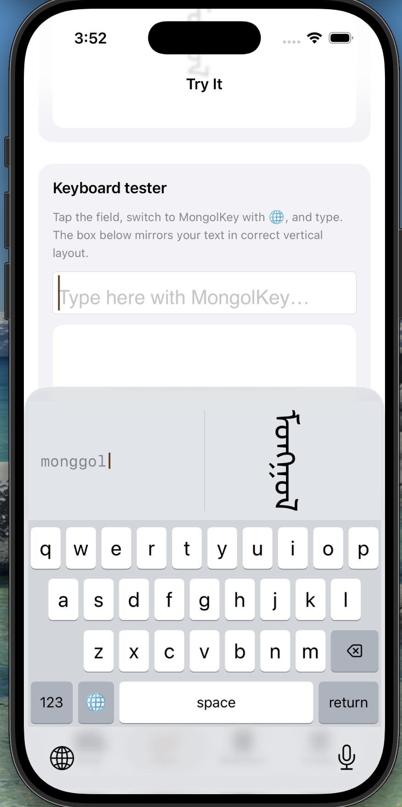

# MongolKey — Mongolian Script Keyboard for iOS

A QWERTY-based input method for **traditional Mongolian script**
(_Mongol bichig_), built as a native iOS Custom Keyboard Extension. Type the
sounds in Latin letters — e.g. `mongol` — and the keyboard suggests the real,
orthographically correct Mongolian-script words you probably mean
(ᠮᠣᠩᠭᠣᠯ), shown **vertically** as you type, exactly like a pinyin IME
suggests Chinese characters.

This repository implements **v1** as described in `PROJECT_DESCRIPTION.md`,
plus dictionary-backed **word suggestions** (see below).

<p>
  
</p>

---

## What works (verified)

Verified by unit tests and by running the app + keyboard in the iOS Simulator
(iPhone 17, iOS 26):

- **Transliteration engine** — longest-match tokenizer, digraph detection
  (`ng kh gh ch sh ts oe ue`), composing buffer with token-level backspace.
- **Word suggestions** — dictionary-backed candidates from a 52,324-entry
  lexicon (28k dictionary words plus 22k corpus-verified inflected forms, each
  indexed under every spelling people type for it),
  ranked by usage frequency, with deterministic spelling-variant folding, a
  rule engine for unseen case suffixes and verb forms, and every rule checked
  against a 79k-line corpus (see “Word suggestions” below).
- **Keyboard extension** — system-style QWERTY grid, a pinyin-style candidate
  bar showing the Latin buffer **and** tappable candidate words rendered
  vertically, a numbers/punctuation layer (incl. Mongolian `᠂` `᠃`), globe key,
  backspace with tap-and-hold repeat, key popups.
- **Vertical rendering** — `Core Text` vertical layout (`vertical-lr`) with
  correct OpenType shaping via bundled Noto Sans Mongolian.
- **Container app** — onboarding, a live romanizer (works without enabling the
  keyboard), a keyboard tester with a vertical mirror, the full reference table
  (generated from the engine), and the privacy screen.
- **No Full Access** — no network, no pasteboard, no shared storage.

---

## Word suggestions (pinyin-style)

Letter-by-letter transliteration cannot produce correct _mongol bichig_: the
script's orthography is historical, so сайн is spelled ᠰᠠᠶᠢᠨ (sayin), аав is
ᠠᠪᠤ (abu) and өдөр is ᠡᠳᠦᠷ (edür) — spellings you cannot reach by typing the
modern sounds one letter at a time. The keyboard therefore works like a
pinyin IME: the Latin buffer is looked up in a bundled lexicon of **52,324
verified spellings for 44,915 Cyrillic word forms**, and the candidate bar
offers the words you probably mean, ranked by how Mongolians actually write
(23.7 million words of news plus 79k lines of lyrics).

**How candidates are ordered (accuracy first):**

1. **Exact dictionary matches** — words pronounced exactly like the buffer,
   most frequent first; homophones such as уг/үг/өг all appear, each
   captioned with its Cyrillic form so you can confirm the word. When the
   previous word is known, the words that usually follow it come first
   (after монгол, typing `uls` puts улсын before улс).
2. **Dictionary stem + suffix** — nouns with case, plural, possessive and
   stacked suffixes (`nomd`, `mongolyn`, `usand`, `nohoinuud`, `aavynhaa`…),
   written detached with a narrow no-break space and shaped by vowel harmony
   and the stem's last written letter (`ᠶᠢᠨ` after a vowel, bare `ᠤ/ᠦ` after
   `ᠨ`, `ᠲᠤ/ᠲᠦ` after hard consonants, the restored hidden n in модонд, the
   vowel Cyrillic drops in бодол → бодлын put back: ᠪᠣᠳᠣᠯ ᠤᠨ); and verbs with
   tense, converb and mood suffixes attached to the infinitive's stem
   (`yavsan` → ᠶᠠᠪᠤᠭᠰᠠᠨ, `avna` → ᠠᠪᠤᠨ᠎ᠠ, `garch` → ᠭᠠᠷᠴᠤ). Every rule in
   `SuffixEngine.swift` / `VerbEngine.swift` cites the corpus table that
   supports it; `python3 tools/verify_corpus.py` regenerates those tables.
3. **Loose spelling** — fills the dictionary tier up to three candidates:
   ө typed as `o` (`odor` → ᠡᠳᠦᠷ; `hol` shows хол, then хөл) and long
   vowels typed single (`uchlaarai` → уучлаарай), closest spelling first.
4. **Rule-based spelling** for a word the dictionary lacks (a name, a rare
   or new word): a known suffix is split off and attached by the suffix
   rules above, and the stem is spelled by rules *learned from the lexicon*
   (`tools/learn_orthography.py` aligns all 37k stem spellings with their
   typed keys and extracts how each letter is written in context). This
   candidate is captioned with the typed Latin, never with a Cyrillic word,
   because it is a best guess: on held-out dictionary words it spells 34% of
   whole words exactly (most letters right in the rest) — far better than
   letter by letter, but not dictionary quality.
5. **The verbatim transliteration** — always present, so anything can be
   typed exactly as intended; captioned with the raw Latin.
6. **Completions** — dictionary words the buffer is a prefix of, most
   frequent first (and usual next words first when the previous word is
   known). Tap-only: **Space never auto-commits a completion**.

**Space** (or any punctuation/return) commits the highlighted default — the
first dictionary-backed candidate, else the rule spelling, else the verbatim
buffer. **Tapping** any candidate commits that word plus a space.

**Next-word prediction.** Right after a word is committed the bar offers the
three words that most often follow it in the corpora (сайн → сайхан, байна,
мэдэх; монгол → улсын, улс, улсад), each with its verified spelling; tapping
one commits it and the bar moves on. Punctuation, a newline or deleting into
the host text ends the phrase.

### Typing variants that are recognized

Mongolians have no single Latin spelling convention, so every word is
indexed under every key people plausibly type for it, and the typed buffer
is folded with the same rules (`LatinKey.fold` ⇄ `fold_key`/`typed_keys` in
`tools/generate_lexicon.py`):

| Cyrillic | Typed as | Example |
| -------- | -------- | ------- |
| х | `h`, `kh`, `x`, `q` | `hair`, `xair`, `khair` → ᠬᠠᠶᠢᠷ᠎ᠠ |
| ц / ч / ш / ж | `ts` or `c`; `ch`; `sh`; `j` | `cag`, `tsag` → ᠴᠠᠭ |
| в | `v`, `w` | `wan` = `van` |
| ө, ү | `u`, `ö`/`ü`, `oe`/`ue`; `o` for ө via the loose tier | `udur`, `ödör`, `odor` → ᠡᠳᠦᠷ |
| й, ы, ь, ъ | `i` or `y`; ы also `ii`; ь/ъ also dropped | `sayn` = `sain`, `nohoy` = `nohoi`, `amdral` = `amidral`, `han` → хан + хань |
| я, ё, ю, е | `ya`, `yo`, `yu`, `ye`; long forms both ways; е also `e` | `yuu` = `yu` → юу, `erunhii` = `yerunhii` |
| long vowels | doubled, or single via the loose tier | `uchlaarai` → уучлаарай |

Folding is deterministic, not fuzzy: each fold was checked against the
dataset to be collision-free (`kh`, `q`, `x`, `w`, standalone `c` and
`y`-before-consonant never occur in the lexicon's own keys), and the loose
tier, which does merge distinct words, always ranks below exact matches.

### Data sources (open datasets)

`tools/generate_lexicon.py` builds `lexicon.tsv` (52,324 entries, 2.9 MB) and
`bigrams.tsv` (29,237 next-word rows for 11,066 words, 1.4 MB);
`tools/learn_orthography.py` then learns `orthography.tsv` (5,904 rules) from
the lexicon. All three live in `Packages/MongolEngine/Sources/MongolEngine/Resources/`
and are committed, so builds are reproducible offline.

| Source | What it provides | License |
| ------ | ---------------- | ------- |
| [`written-mongol-keyboard`](https://www.npmjs.com/package/written-mongol-keyboard) npm package ([repo](https://github.com/sura0111/writtenMongolianKeyboard)) | ~28k entries of {Cyrillic word, typed romanization, traditional-script spelling} | MIT |
| [`tugstugi/mongolian-nlp`](https://github.com/tugstugi/mongolian-nlp) `bichig2cyrillic/lyrics.txt.gz` | ~79k lines of Cyrillic lyrics converted to traditional script by Inner Mongolia University's converter; word-aligned, so ~22k inflected forms (аавдаа, явсан, надад…) join the lexicon, and every suffix rule is checked against it | see repo |
| [`tugstugi/mongolian-nlp`](https://github.com/tugstugi/mongolian-nlp) `datasets/eduge.csv.gz` | 75,661 Mongolian news articles (23.7M words): the frequency of every word form (ranks homophones and completions) and the word-pair counts behind next-word prediction | see repo |

The generator drops ~290 defective source rows (entries whose
traditional-script column contains Latin/CJK/replacement characters — leftover
converter errors) and 265 lyrics misspellings that had been converted letter
by letter (баина, хаиртаи…), rather than ship wrong spellings.

What "correct" means here: a dictionary-backed candidate is exactly the
spelling of its source (the dictionary, or Inner Mongolia University's
converter over the lyrics); suffix rules are only those the corpus supports;
rule-spelled and verbatim candidates make no such claim and are captioned
with Latin. A native-speaker review of the sources' own errors is still the
right final step before a wide release.

Everything stays on-device: the tables are build-time resources inside the
app bundle, so the keyboard still needs **no network and no Full Access**.

---

## Typefaces

Two Mongolian faces ship in both the app and the keyboard
(`Shared/Fonts/`, licences in `Shared/Fonts/LICENSES.md`):

| Face | Look | Licence |
| ---- | ---- | ------- |
| **Classical Mongolian Dashitseden** (Bolorsoft, T. Jamyansuren) | calligraphic brush face, what readers of Mongol bichig expect (bolor-toli.com renders with it) | Bolorsoft free font: free to distribute and use, not to modify |
| **Noto Sans Mongolian** (Google) | clean sans face | SIL OFL 1.1 |

- **Keyboard:** the **ᠠ key** at the bottom left (where the 🌐 key used to be —
  iOS 26 and every Face ID iPhone provide the input switcher in the bar
  below the keyboard, so the keyboard only shows its own 🌐 when
  `needsInputModeSwitchKey` says it must) cycles the typeface. The key
  draws its ᠠ in the current face, so it always shows which one is active;
  the candidate bar redraws immediately. The choice is remembered.
- **App:** Try It ▸ Typeface switches the app's own views; remembered too.
- The keyboard and the app are separate processes with separate settings
  (sharing one would need an App Group), so each remembers its own choice.
- The text you send is plain Unicode: **the receiving app renders it with
  its own font**. The typeface choice affects what the keyboard and this
  app draw, not what WhatsApp or Messages show.

`MongolFont.swift` registers both faces at launch and falls back to the other
face (then the system font) if a file is missing — a missing font can never
crash the app or the keyboard. `tools/ShapeProbe.swift` (run by CI) prints
how CoreText shapes test words with each face and renders them, which is
how their handling of the vowel separator U+180E is verified.

---

## Architecture

Three components, matching `PROJECT_DESCRIPTION.md §7`:

```
Packages/MongolEngine/     Pure Swift package (no UIKit) — the transliteration
                           engine + longest-match tokenizer + scheme, plus the
                           suggestion pipeline (LatinKey folding, Lexicon,
                           SuggestionEngine) and the bundled lexicon.tsv
                           resource. Unit-tested.

tools/                     generate_lexicon.py — reproducible generator for
                           lexicon.tsv from the open datasets (see above).

Keyboard/                  UIInputViewController keyboard extension. Delegates all
                           transliteration to MongolEngine; renders the QWERTY grid
                           and the vertical composing bar.

App/MongolKey/             SwiftUI container app (onboarding, try-it, reference,
                           privacy). Shares MongolEngine for the live romanizer.

Shared/Rendering/          VerticalMongolianView (Core Text) + MongolFont loader,
                           compiled into both the app and the extension.

Shared/Fonts/              NotoSansMongolian-Regular.ttf (SIL OFL) + license.
```

The engine has **no UIKit dependency**, so it is testable with plain XCTest and
reusable on macOS/watchOS later (`§12.6`).

---

## Running the project

### Prerequisites

- macOS with **Xcode 16+** (developed on Xcode 26). Install from the App Store
  or [developer.apple.com](https://developer.apple.com/xcode/).
- **[XcodeGen](https://github.com/yonaskolb/XcodeGen)** — the `.xcodeproj` is
  generated, not committed (see `.gitignore`), so this is required, not optional:
  ```sh
  brew install xcodegen
  ```
- No Apple Developer account is needed to run in the **Simulator**. You only
  need one (and a signing team set in Xcode ▸ Signing & Capabilities) to run on
  a **physical device**.

### Quickstart (Simulator, GUI)

```sh
git clone <this-repo>
cd "Mongolian Script Keyboard"
xcodegen generate        # turns project.yml into MongolKey.xcodeproj — do this every time you pull
open MongolKey.xcodeproj
```

Then in Xcode:

1. Top-left scheme selector → choose **MongolKey** (this scheme builds both the
   container app and the `MongolKeyboard` extension together).
2. Next to it, pick any iPhone **Simulator** as the run destination.
3. Press **⌘R** (Run). The MongolKey app launches in the simulator.
4. A keyboard extension can't be "run" directly — it only activates once it's
   enabled system-wide. In the app, go to the **Setup** tab and tap
   **Open Settings**, or manually:
   **Settings ▸ General ▸ Keyboard ▸ Keyboards ▸ Add New Keyboard… ▸ MongolKey**.
5. Go back to the app's **Try It** tab (or any other app, e.g. Notes), tap into
   a text field, press and hold 🌐 (or tap it repeatedly) to switch to
   **MongolKey**, and start typing romanized Mongolian (e.g. `gar`).

You only need to repeat step 4 once per fresh install of the app — iOS remembers
the enabled keyboard until the app is deleted or the simulator is erased.

### One-command simulator run / testing without a Mac

`tools/simulate.sh` does the whole recipe below on an **iPhone 13 Pro**-sized
simulator in one go, and the **iOS Simulator** GitHub Actions workflow builds
the app and screenshots every screen (keyboard included) on each push, with an
optional Appetize.io link to try it interactively in a browser from Windows or
Linux. See [docs/TESTING.md](docs/TESTING.md).

### Command line

```sh
# Fastest feedback loop: engine unit tests, no simulator needed
cd Packages/MongolEngine && swift test
```

The full copy-paste recipe to build, install, and launch on a simulator, start
to finish:

```sh
cd "Mongolian Script Keyboard"

# 1. Regenerate the Xcode project (needed after cloning or editing project.yml)
xcodegen generate

# 2. Find a simulator device id
xcrun simctl list devices available

# 3. Build the app + keyboard extension for it
SIM=<device-id-from-step-2>          # e.g. 6A42F695-8352-44D3-B5E0-33A2FCC7CEF4
xcodebuild -project MongolKey.xcodeproj -scheme MongolKey \
  -sdk iphonesimulator -destination "id=$SIM" \
  -configuration Debug CODE_SIGN_IDENTITY=- build   # ad-hoc sign; a fully unsigned extension is never offered as a keyboard

# 4. Boot the simulator and open the Simulator.app window
xcrun simctl boot $SIM
open -a Simulator

# 5. Install and launch the freshly built app
APP=$(find ~/Library/Developer/Xcode/DerivedData/MongolKey-*/Build/Products/Debug-iphonesimulator \
  -maxdepth 1 -name "MongolKey.app" | head -1)
xcrun simctl install $SIM "$APP"
xcrun simctl launch $SIM com.mongolkey.app
```

Step 4 (`simctl boot`) errors harmlessly with "Unable to boot device in current
state: Booted" if the simulator is already running — safe to ignore.

Enabling the keyboard itself (step 4 in the GUI walkthrough above) is a system
Settings action, not something `xcodebuild`/`simctl` can automate — it must be
done once by hand through the Settings app on the simulator or device.

### Troubleshooting

- **`xcodebuild: error: … MongolKey.xcodeproj … does not exist`** — you skipped
  `xcodegen generate`. The project file is git-ignored on purpose so
  `project.yml` stays the single source of truth.
- **Keyboard doesn't show up under "Add New Keyboard…"** — rebuild and reinstall
  the app (the extension ships inside the app bundle); if it was installed
  before, delete the app from the simulator/device first, then reinstall.
- **Nothing happens when typing** — make sure you actually switched keyboards
  with 🌐; the system keyboard is very similar in outline and easy to miss.
- **The app (or the keyboard) crashes** — `tools/simulate.sh` checks that the
  app is still running four seconds after launch and, if it is not, prints the
  newest crash report itself (exception, fatal-error message, top frames) and
  exits with status 70. For a crash later on (say, the keyboard while typing)
  run `tools/crashlog.sh` (`--all` lists every report). A keyboard that
  vanishes without a report was killed by iOS for memory (keyboard extensions
  get ~50 MB); CI's "Plain launch" step runs the same install + `simctl launch`
  path on every push. After several rebuilds on the same simulator, try
  `tools/simulate.sh --fresh` (uninstalls first, so no stale copy of the
  keyboard extension stays registered; re-enable the keyboard in Settings).

---

## Developing further

### The inner dev loop

- **Changing engine logic (mapping table, tokenizer, buffer)** — edit under
  `Packages/MongolEngine/Sources/MongolEngine/`, then run
  `cd Packages/MongolEngine && swift test`. This is a plain SwiftPM package with
  no UIKit dependency, so this loop takes about a second and never needs a
  simulator.
- **Changing keyboard UI or app UI** — after editing, you need a full rebuild +
  reinstall (extensions don't hot-reload): re-run the "Command line" recipe
  above from step 3, or press ⌘R again from Xcode. If you only touched Swift
  files (no new files, no `Info.plist`/`project.yml` changes), you can skip
  `xcodegen generate` and just rebuild.
- **Adding a new source file** — drop it into the right folder below and re-run
  `xcodegen generate`. Target membership is folder-based in `project.yml`
  (e.g. `sources: [App/MongolKey, Shared/Rendering]`), so there's nothing to
  wire up by hand in Xcode.

### Where things live

| I want to…                                                     | Edit this                                                                                                                                                                                                                                                                                                                                       |
| -------------------------------------------------------------- | ----------------------------------------------------------------------------------------------------------------------------------------------------------------------------------------------------------------------------------------------------------------------------------------------------------------------------------------------- |
| Add/change a Latin → Mongolian mapping                         | `Packages/MongolEngine/Sources/MongolEngine/TransliterationScheme.swift` — add a `SchemeEntry(...)`; it automatically appears in the keyboard and the in-app Reference tab, and should be covered by `testEveryEntryRoundTrips()` in the test target                                                                                            |
| Change tokenizing/digraph rules                                | `Packages/MongolEngine/Sources/MongolEngine/Tokenizer.swift`                                                                                                                                                                                                                                                                                    |
| Change what a key does: composing, committing, predictions, when the "previous word" context is kept | `Packages/MongolEngine/Sources/MongolEngine/InputSession.swift` — the keyboard's whole state machine, unit-tested in `InputSessionTests.swift`; `Keyboard/KeyboardViewController.swift` only applies its commands to the host field |
| Change composing-buffer / backspace (token) behavior           | `Packages/MongolEngine/Sources/MongolEngine/TransliterationEngine.swift`                                                                                                                                                                                                                                                                        |
| Change how the app's live romanizer spells words               | `Packages/MongolEngine/Sources/MongolEngine/PhraseSpeller.swift` — it reuses the keyboard's candidate pipeline so the app and the keyboard always agree                                                                                                                                                                                          |
| Add/rearrange keyboard keys or layers                          | `Keyboard/KeyCap.swift` (layout data) → `Keyboard/KeyboardView.swift` (layout math) → `Keyboard/KeyButton.swift` (per-key rendering/behavior)                                                                                                                                                                                                   |
| Change candidate ranking or the default-commit rule            | `Packages/MongolEngine/Sources/MongolEngine/SuggestionEngine.swift`                                                                                                                                                                                                                                                                             |
| Change spelling-variant folding (kh/h/x, c/ts, ö/ü/oe/ue…)     | `LatinKey.swift` **and** `fold_key()` in `tools/generate_lexicon.py` — they must stay in sync; regenerate `lexicon.tsv` after changing                                                                                                                                                                                                          |
| Regenerate / update the word lexicon                           | `python3 tools/generate_lexicon.py` (writes `Packages/MongolEngine/Sources/MongolEngine/Resources/lexicon.tsv`)                                                                                                                                                                                                                                 |
| Change the candidate-bar look or tap behavior                  | `Keyboard/CandidatePreviewBar.swift`                                                                                                                                                                                                                                                                                                            |
| Change vertical Mongolian rendering                            | `Shared/Rendering/VerticalMongolianView.swift` — **read the file header before touching this.** It deliberately shapes text horizontally (for correct cursive letter joining) and rotates the shaped glyphs 90° clockwise at draw time, rather than using Core Text's native vertical-forms attribute, which was found to break letter joining. |
| Change app screens (onboarding / try-it / reference / privacy) | `App/MongolKey/*View.swift` (SwiftUI)                                                                                                                                                                                                                                                                                                           |
| Change bundle IDs, deployment target, or add a target          | `project.yml`, then `xcodegen generate`                                                                                                                                                                                                                                                                                                         |

### Testing checklist for a change

1. `cd Packages/MongolEngine && swift test` — must stay green; add a test next
   to the existing ones in `Packages/MongolEngine/Tests/MongolEngineTests/` for
   any new mapping, tokenizer rule, folding rule, ranking change, or key
   behaviour (`SuggestionEngineTests.swift` covers the suggestion pipeline,
   `InputSessionTests.swift` the keyboard's key-by-key behaviour).
2. Rebuild and reinstall (see the command-line recipe above), re-enable the
   keyboard if this is a fresh install, and manually type a few words in the
   **Try It** tab and in another app (e.g. Notes) — the engine tests don't
   cover UIKit wiring or the `UITextDocumentProxy` bridge in
   `Keyboard/KeyboardViewController.swift`; CI's simulator UI test does.
3. Check both light and dark mode if you touched `Keyboard/KeyboardColors.swift`
   or any view's colors.

---

## Transliteration scheme (v1)

One scheme ships in v1 (`§9`). It is phonetic-first with digraphs matched before
their component letters. The draft table in `PROJECT_DESCRIPTION.md §9` had a few
conflicting rows (three different meanings for `kh`); those were resolved so
every Latin key is unambiguous. The scheme lives in
`Packages/MongolEngine/Sources/MongolEngine/TransliterationScheme.swift` and is
the single source of truth for both the keyboard and the in-app reference table.

| Type       | Type this                               | Get         | Notes                         |
| ---------- | --------------------------------------- | ----------- | ----------------------------- |
| Vowels     | `a e i o u`                             | ᠠ ᠡ ᠢ ᠣ ᠤ   |                               |
|            | `oe`/`ö`, `ue`/`ü`                      | ᠥ ᠦ         |                               |
| Digraphs   | `ng kh gh ch sh ts`                     | ᠩ ᠬ ᠭ ᠴ ᠱ ᠼ | matched before single letters |
| Consonants | `n b p q g m l s t d j y r w/v f k z h` | …           | see the in-app Reference tab  |

> The scheme is a solid v1 starting point. Per `§15`, native-speaker
> orthographic sign-off (Phase 8) is a separate human step that will refine the
> table; the tests assert the engine's _contract_, not linguistic authority.

---

## Known limitations

Per `PROJECT_DESCRIPTION.md §19`: host apps display the inserted text
horizontally (only the keyboard's candidate bar and the app's views show it
vertically); one scheme.

Suggestion-specific limitations:

- A Cyrillic word absent from both sources (the dictionary and the lyrics
  corpus) has no verified spelling: it gets the rule spelling (34% exact on
  held-out words) and the verbatim transliteration, both captioned in Latin.
- A few very common words (e.g. бид in some forms) were dropped because
  their traditional-script column in the source dataset was defective.
- The suffix engine handles one case suffix (optionally followed by the
  reflexive), one verb suffix, and one dropped stem vowel. Irregular
  pronouns (би → надад) and irregular verbs (өгөх → ᠥᠭᠭᠦᠭᠰᠡᠨ) are covered
  only where the corpus supplied the form.
- Corpus spellings are machine-converted (Inner Mongolia University's
  converter); frequencies mix news (formal) and lyrics (colloquial) usage.
- Next-word prediction looks at one previous word (bigrams) and only at
  words the lexicon can spell.

---

## Shipping it

See [docs/RELEASE.md](docs/RELEASE.md) for the Apple Developer Program,
TestFlight and App Store steps that let anyone install the keyboard.

## Privacy

No data collected. No Full Access. See [PRIVACY.md](PRIVACY.md).

## Font license

Noto Sans Mongolian is licensed under the SIL Open Font License 1.1. See
[`Shared/Fonts/OFL.txt`](Shared/Fonts/OFL.txt).
